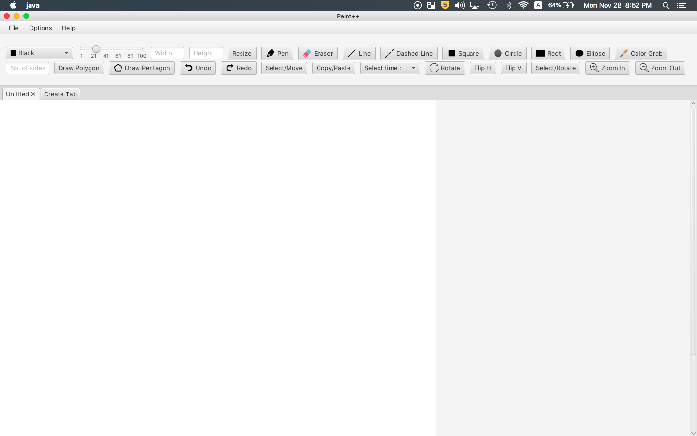

# Paint00

Paint00 is the implementation of the Microsoft Paint application using Java/JavaFX.

## Roadmap

Demo Link: https://youtu.be/2GO7Qhs7voM

### Paint Version 3.1 -  11/28/2022
New features:
- Zoom In and Zoom Out
- Menu Item "About" redirects to the GitHub Link

### Paint Version 3.0 -  10/21/2022
New features:
- Rotate image (90/180/270)
- Rotate a selection of canvas (90/180/270)
- Tooltips to all buttons
- Horizontal and Vertical flip
- Threaded logging to log the tools used, logs at a constant 20 sec interval

Known issues:

Expected next sprint:

### Paint Version 2.1 -  10/01/2022
New features:
- Save as 3 different file format
- Warn when user saves in a low quality image
- Auto save at 10 seconds
- 3 Unit Test
- Javadoc

Known issues:

Expected next sprint:
- move tool
- add icon to toggle buttons
- 
### Paint Version 2.0 -  10/01/2022
New features:
- Undo/Redo options
- Clear canvas with alert
- Draw Polygon of n-sides
- Fix tab issue with inability to save and open
- Select/Move tool for a portion of image
- Copy/Paste tool to copy and paste portion of the image

Known issues:

Expected next sprint:
- move tool
- add icon to toggle buttons

### Paint Version 1.1 -  09/26/2022
New features:
- separate Main file into 7 class files
- make 2 files for canvas
- circle, ellipse, square, and rectangle tool
- support three image types
- 4 keyboard shortcuts
- color grabber
- line tool
- smart save - Dialog box upon exit
- Tabs with ability to add tabs
  Known issues:
- dashed line not working
- unable to save a different tab
  Expected next sprint:
- fix tab issues

### Paint Version 1.0 -  09/15/2022
New features:
- draw into the canvas
- save the image
- work space resize to fit the image opened
- scroll bar
- select line width
- color chooser
- help menu item with help and about section
- eraser tool

Known issues:
- Run time error after opening Paint 

Expected next sprint:
- create different class file

### Paint Version 0.0 -  09/09/2022
New features:
- menu bar
- open .png, .bmp or any image file
- save As .png or .bmp

Known issues:

Expected next sprint:
- implement version control - GitHub